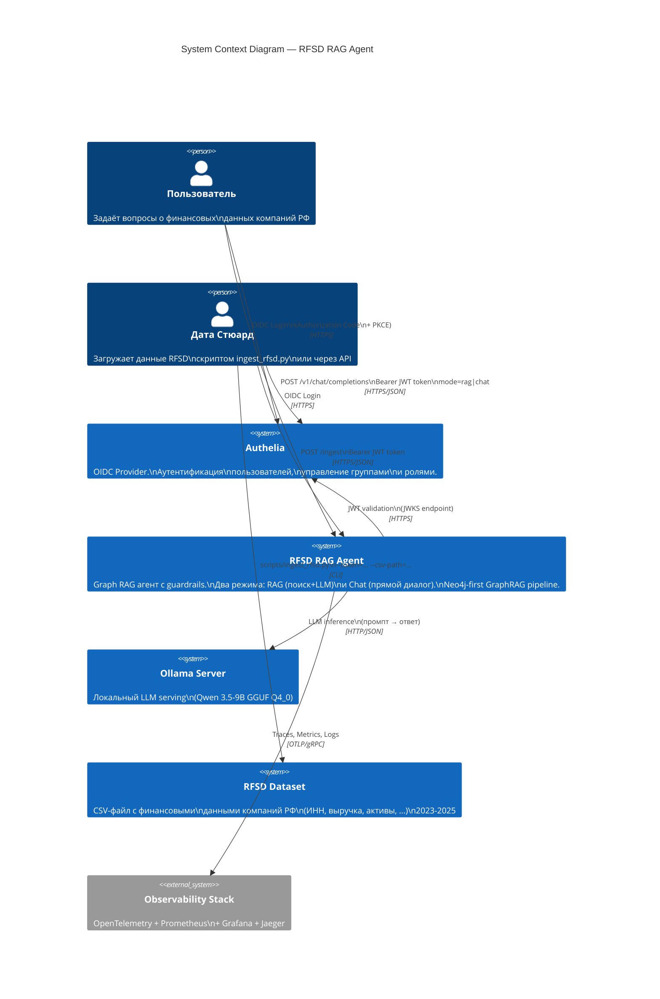

# C4 Level 1 — Context Diagram

## RFSD RAG Agent — System Context

## Описание

| Актёр/Система | Роль |
|---|---|
| **Пользователь** | Отправляет вопросы через REST API. Авторизуется через Authelia (OIDC). Роль определяется из JWT. Два режима: `rag` (поиск в графе + LLM) и `chat` (прямой диалог с LLM). |
| **Дата Стюард** | Загружает RFSD CSV через скрипт `scripts/ingest_rfsd.py` или API endpoint `/ingest-rfsd`. Только с ролью DATA_STEWARD. |
| **Authelia** | OIDC Provider — аутентификация, управление пользователями и группами. Выдаёт JWT-токены. |
| **RFSD RAG Agent** | Graph RAG агент: Neo4j-first поиск компании → Qdrant текст → Neo4j финансовые данные → LLM ответ. Guardrails + RBAC. |
| **Ollama Server** | Локальный LLM serving на базе Qwen 3.5-9B (GGUF Q4_0). Reasoning отключён (`/no_think`). |
| **RFSD Dataset** | CSV-файл с финансовыми данными ~600К компаний РФ за 2023-2025 гг. |
| **Observability Stack** | Сбор трейсов, метрик и логов через OpenTelemetry Collector. |
