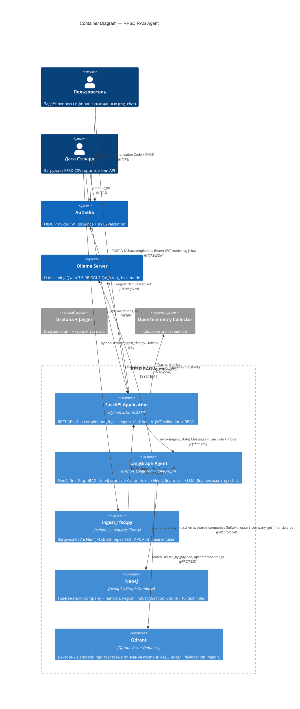

# C4 Level 2 — Container Diagram

## RFSD RAG Agent — Containers



## Описание контейнеров

| Контейнер | Технология | Назначение |
|---|---|---|
| **FastAPI Application** | Python 3.12, FastAPI, Pydantic | REST API: `/v1/chat/completions`, `/ingest`, `/ingest-rfsd`, `/health`. JWT validation + RBAC. |
| **LangGraph Agent** | Python, LangGraph StateGraph | Neo4j-first GraphRAG pipeline: 5 нод с conditional edges. Два режима: `rag` (retrieval+LLM) и `chat` (прямой LLM). |
| **ingest_rfsd.py** | Python CLI, requests | Скрипт загрузки RFSD CSV через REST API. Авторизация bearer token. |
| **Authelia** | Authelia 4.38 | OIDC Provider: аутентификация, управление пользователями/группами, выдаёт JWT. |
| **Neo4j** | Neo4j 5.x | Граф знаний: Company, Financials, Region, IndustrySection, Chunk. Fuzzy fulltext search по названию. RBAC на уровне Cypher. |
| **Qdrant** | Qdrant | Векторная БД: текстовые описания компаний. Поиск по вектору (semantic) и по payload (INN). |
| **Ollama Server** | Ollama + Qwen 3.5-9B | Локальный LLM serving. GGUF Q4_0. `/no_think` mode для отключения reasoning. |

## Data Flow: GraphRAG Query (mode=rag)

```
1. User → FastAPI: POST /v1/chat/completions {messages, user_role, mode="rag"}
2. FastAPI → LangGraph: invoke(state)
3. extract_input → input_guardrail (RBAC: restricted_fields)
4. graph_rag_fetch:
   4a. Neo4j: search_companies(query, limit=1) → [Company{inn, name}]
   4b. Qdrant: search_by_payload(inn) → text description
   4c. Neo4j: get_financials_by_inns([inn], restricted_fields) → [facts]
   4d. Fallback: Qdrant semantic search → INN → Neo4j
5. Conditional: data_found?
   - Yes → llm_generation: prompt(facts + /no_think + question) → answer
   - No  → no_data_response: "Инformation not found"
6. output_guardrail: validate(facts, answer)
7. FastAPI → User: {choices: [{message: {content: answer}}]}
```

## Data Flow: Chat Query (mode=chat)

```
1. User → FastAPI: POST /v1/chat/completions {messages, user_role, mode="chat"}
2. FastAPI → LangGraph: invoke(state)
3. extract_input → input_guardrail
4. graph_rag_fetch: SKIP (mode=chat, data_found=false)
5. no_data_response → llm_generation: prompt(/no_think + question) → answer
6. FastAPI → User: {choices: [{message: {content: answer}}]}
