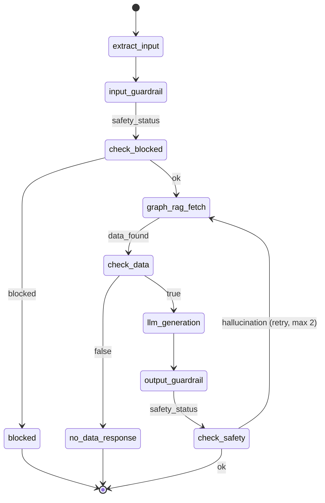

# C4 Level 3 — Component Diagram

## RFSD RAG Agent — Components inside FastAPI Application

```mermaid
C4Component
    title Component Diagram — RFSD RAG Agent (FastAPI Application)

    Person(user, "Пользователь", "Задаёт вопросы\n(rag|chat)")
    Person(data_steward, "Дата Стюард", "Загружает данные\nскриптом или API")

    Container_Boundary(fastapi_app, "FastAPI Application") {
        Component(routes, "Routes", "FastAPI Router", "Эндпоинты: /health,\n/v1/chat/completions,\n/ingest, /ingest-rfsd")

        Component(schemas, "API Schemas", "Pydantic Models", "ChatCompletionRequest,\ningest-rfsd-records,\nIngestResponse, HealthResponse")

        Component(chat_uc, "ChatCompletion\nUseCase", "Application Layer", "Оркестрация чат-запроса:\nформирует LangGraph state\n(+ mode, raw_query),\nвызывает agent.invoke()")

        Component(ingest_rfsd_uc, "IngestRFSD\nUseCase", "Application Layer", "Загрузка записей → Neo4j + Qdrant:\nCompany + Financials + текст.\nBatch embed (FastEmbed).\nУсловный MERGE Region.")

        Component(ingest_doc_uc, "IngestDocuments\nUseCase", "Application Layer", "Загрузка документов:\nchunking → embed → store")

        Component(agent_graph, "LangGraph\nStateGraph", "Agent Orchestration", "5 шагов:\nextract → guardrail →\ngraph_rag_fetch →\ndata_found? → llm/no_data\n→ validate")

        Component(extract_node, "ExtractInput\nNode", "Agent Node", "Извлечение raw_query\nиз messages или state")

        Component(input_guardrail, "InputGuardrail\nNode", "Agent Node", "Фильтрация prompt injection\n+ RBAC: вычисление\nrestricted_fields из user_role")

        Component(graph_rag_node, "GraphRAG\nFetch Node", "Agent Node", "Neo4j-first:\n1. search_companies(limit=1)\n2. Qdrant search_by_payload(INN)\n3. Neo4j get_financials_by_inns\n+ timing-логи")

        Component(no_data_node, "NoData\nResponse Node", "Agent Node", "Пропуск LLM:\n\"Инformation not found\"")

        Component(llm_node, "LLMGeneration\nNode", "Agent Node", "/no_think промпт\n+ retrieved_facts + query\n→ Ollama LLM")

        Component(output_guardrail, "OutputGuardrail\nNode", "Agent Node", "LLM-as-a-Judge:\nпроверка галлюцинаций")

        Component(input_guardrail_svc, "InputGuardrail\nService", "Guardrails", "Проверка на prompt injection,\nзаблокированные фразы")

        Component(output_guardrail_svc, "OutputGuardrail\nService", "Guardrails", "LLM-as-a-Judge: сверка\nответа с фактами")

        Component(ports, "Ports", "Application Ports", "VectorStorePort,\nGraphStorePort,\nEmbedderPort, LLMPort")

        Component(qdrant_adapter, "QdrantVectorStore\nAdapter", "Infrastructure", "search, search_by_payload\n(payload key/value),\nupsert, ensure_collection")

        Component(neo4j_adapter, "Neo4jGraphStore\nAdapter", "Infrastructure", "init_schema (per-stmt),\nsearch_companies (exact+fuzzy),\nupsert_company_with_financials,\nget_financials_by_inns,\nnotifications_min_severity=WARNING")

        Component(embedder_adapter, "FastEmbedEmbedder\nAdapter", "Infrastructure", "embed_text, embed_texts\n(multilingual-e5-small,\nкастомная регистрация модели)")

        Component(entities, "Domain Entities", "Domain Layer", "Company, Financials, Chunk\n(+ metadata field),\nDocument, GuardrailResult,\nROLE_ALLOWED_FIELDS")

        Component(rbac, "RBAC Policy", "Domain Layer", "get_restricted_fields():\nUSER → only pl_revenue\nFINANCE → all fields")
    }

    Container(neo4j_db, "Neo4j", "Graph Database", "Company, Financials,\nRegion, IndustrySection,\nChunk + fulltext index")
    Container(qdrant_db, "Qdrant", "Vector Database", "Embeddings + payload\n(inn, region, okved_section)")
    System(ollama, "Ollama", "LLM serving\nQwen 3.5-9B\n/no_think")

    Rel(user, routes, "POST /v1/chat/completions\n{messages, user_role, mode}")
    Rel(data_steward, routes, "POST /ingest-rfsd\n{records: [...]}\nBearer JWT")
    Rel(routes, chat_uc, "execute_chat_completion()")
    Rel(routes, ingest_rfsd_uc, "execute_ingest_rfsd_batch()")

    Rel(chat_uc, agent_graph, "agent.invoke(state)\n+ raw_query, mode")
    Rel(agent_graph, extract_node, "extract_input")
    Rel(agent_graph, input_guardrail, "input_guardrail")
    Rel(agent_graph, graph_rag_node, "graph_rag_fetch")
    Rel(agent_graph, no_data_node, "no_data_response\n(if not data_found)")
    Rel(agent_graph, llm_node, "llm_generation\n(if data_found)")
    Rel(agent_graph, output_guardrail, "output_guardrail")

    Rel(input_guardrail, rbac, "get_restricted_fields(role)")
    Rel(graph_rag_node, neo4j_adapter, "search_companies(query, limit=1)")
    Rel(graph_rag_node, qdrant_adapter, "search_by_payload(inn)")
    Rel(graph_rag_node, neo4j_adapter, "get_financials_by_inns([inn])")
    Rel(llm_node, ollama, "invoke(/no_think + prompt)")

    Rel(ports, qdrant_adapter, "implements")
    Rel(ports, neo4j_adapter, "implements")
    Rel(ports, embedder_adapter, "implements")

    Rel(qdrant_adapter, qdrant_db, "gRPC/REST")
    Rel(neo4j_adapter, neo4j_db, "Bolt")

    Rel(ingest_rfsd_uc, neo4j_adapter, "upsert_company_with_financials()\n+ link_company_to_chunk()")
    Rel(ingest_rfsd_uc, qdrant_adapter, "upsert(chunks, embeddings)")
    Rel(ingest_rfsd_uc, embedder_adapter, "embed_texts(texts)")

    UpdateLayoutConfig($c4ShapeInRow="4", $c4BoundaryInRow="1")
```

## Архитектурные слои (Clean Architecture)

```
┌─────────────────────────────────────────────────────────────────────┐
│  PRESENTATION LAYER (FastAPI)                                       │
│  ┌──────────────┐  ┌──────────────┐  ┌──────────────┐              │
│  │    Routes     │  │   Schemas    │  │    App.py    │              │
│  │  /health      │  │  Pydantic    │  │  Bootstrap   │              │
│  │  /chat        │  │  Models      │  │  Wiring      │              │
│  │  /ingest      │  │              │  │              │              │
│  └──────┬───────┘  └──────────────┘  └──────────────┘              │
├─────────┼───────────────────────────────────────────────────────────┤
│  APPLICATION LAYER                                                  │
│  ┌──────┴───────┐  ┌──────────────┐  ┌──────────────┐              │
│  │  Use Cases    │  │  Agent       │  │  Guardrails  │              │
│  │  ChatCompl.   │  │  LangGraph   │  │  Input       │              │
│  │  IngestRFSD   │  │  StateGraph  │  │  Output      │              │
│  │  IngestDocs   │  │  5 nodes +   │  │  Pipeline    │              │
│  │               │  │  conditional │  │              │              │
│  └──────┬───────┘  └──────┬───────┘  └──────────────┘              │
├─────────┼─────────────────┼─────────────────────────────────────────┤
│  DOMAIN LAYER                                                       │
│  ┌──────┴───────┐  ┌──────┴───────┐  ┌──────────────┐              │
│  │  Entities     │  │  Ports       │  │  RBAC        │              │
│  │  Company      │  │  VectorStore │  │  ROLE_ALLOWED│              │
│  │  Financials   │  │  GraphStore  │  │  _FIELDS     │              │
│  │  Chunk +meta  │  │  Embedder    │  │  Policy      │              │
│  └──────────────┘  └──────────────┘  └──────────────┘              │
├─────────────────────────────────────────────────────────────────────┤
│  INFRASTRUCTURE LAYER                                               │
│  ┌──────────────┐  ┌──────────────┐  ┌──────────────┐              │
│  │ QdrantStore   │  │ Neo4jStore   │  │ FastEmbed    │              │
│  │ Adapter       │  │ Adapter      │  │ Adapter      │              │
│  │ search_by_    │  │ search_      │  │ multilingual │              │
│  │ payload       │  │ companies    │  │ -e5-small    │              │
│  └──────┬───────┘  └──────┬───────┘  └──────────────┘              │
│         │                  │                                         │
│    ┌────┴────┐      ┌─────┴─────┐                                   │
│    │  Qdrant │      │   Neo4j   │                                   │
│    └─────────┘      └───────────┘                                   │
└─────────────────────────────────────────────────────────────────────┘
```

## Компоненты агента (LangGraph StateGraph)



| Шаг | Файл | Описание |
|---|---|---|
| `extract_input` | `nodes.py:extract_input_node` | Извлекает `raw_query` из messages или state |
| `input_guardrail` | `nodes.py:input_guardrail_node` | Проверяет prompt injection, вычисляет RBAC `restricted_fields` |
| `graph_rag_fetch` | `nodes.py:graph_rag_fetch_node` | Neo4j-first: search_companies → Qdrant search_by_payload → Neo4j financials. Fallback: Qdrant semantic. Timing-логи. |
| `no_data_response` | `nodes.py:no_data_response_node` | Пропускает LLM: "Инformation not found" (если `data_found=false`) |
| `llm_generation` | `nodes.py:llm_generation_node` | `/no_think` + retrieved_facts + query → Ollama LLM |
| `output_guardrail` | `nodes.py:output_guardrail_node` | LLM-as-a-Judge: сверяет ответ с фактами, при hallucination → retry |

## GraphRAG Fetch Node — Pipeline (Neo4j-first)

```
┌─────────────────────────────────────────────────────────────────┐
│  graph_rag_fetch_node                                            │
│                                                                  │
│  Step 1: Neo4j search_companies(query, limit=1)     ~0.3s       │
│    └→ EXACT CONTAINS: short_name/full_name                       │
│    └→ FUZZY: fulltext index (Levenshtein ~2)                    │
│    └→ Result: Company{inn, short_name}                           │
│                                                                  │
│  Step 2a: Qdrant search_by_payload(inn=INN, limit=1) ~0.1s     │
│    └→ Text description (без чисел)                              │
│                                                                  │
│  Step 2b: Fallback — Qdrant semantic search         ~0.5s       │
│    └→ embed_text(query) → vector search                         │
│    └→ INN from payload                                          │
│                                                                  │
│  Step 3: Neo4j get_financials_by_inns([INN])        ~0.2s       │
│    └→ RBAC: restricted_fields excluded in Cypher                │
│    └→ All years (year=None)                                     │
│                                                                  │
│  Output: retrieved_facts = text_descriptions + financial_facts   │
└─────────────────────────────────────────────────────────────────┘
