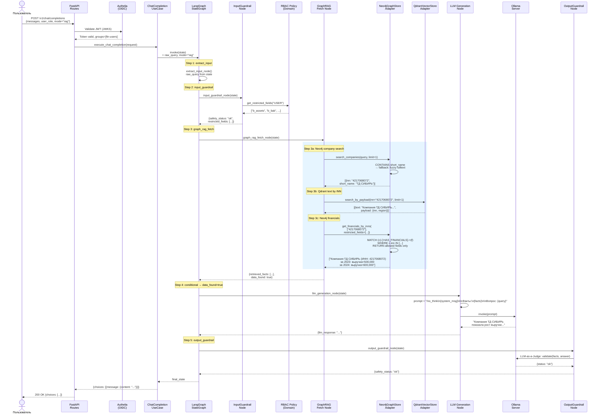
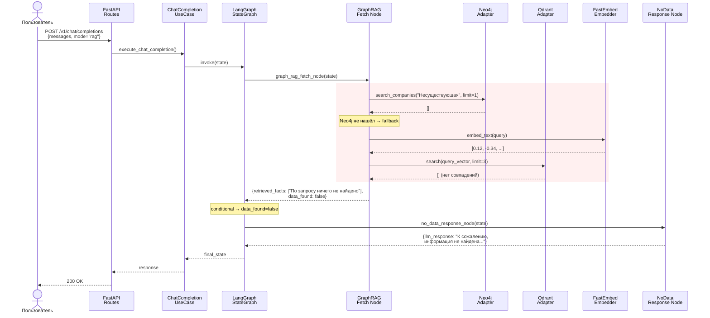
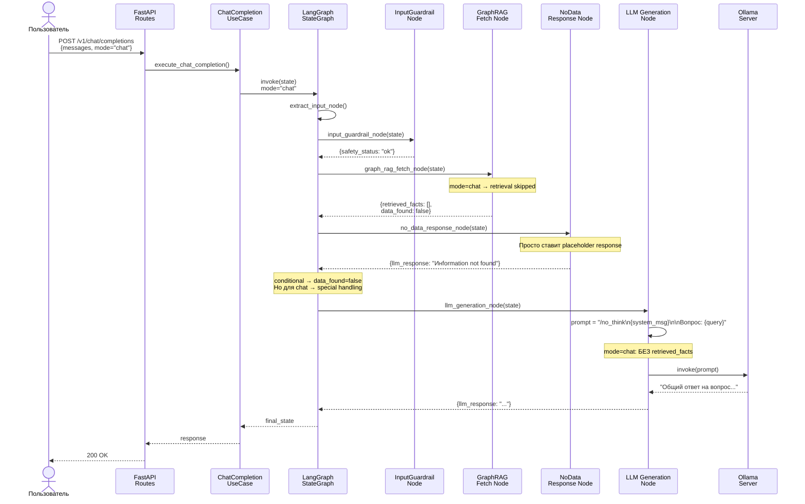
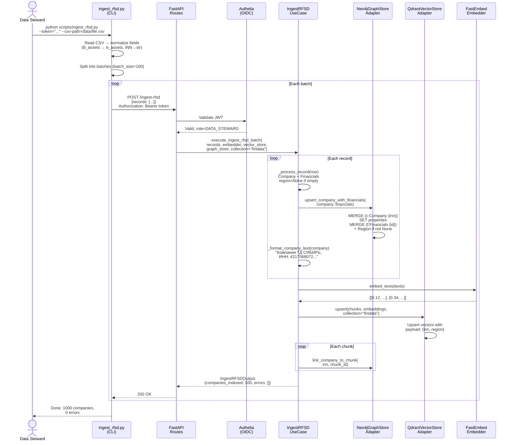

# UML Sequence Diagrams — RFSD RAG Agent

## 1. RAG Query — GraphRAG Pipeline (mode=rag)

Пользователь задаёт вопрос о компании. Система ищет в Neo4j, получает текст из Qdrant, запрашивает финансовые данные и генерирует ответ через LLM.



## 2. RAG Query — No Data Found (mode=rag)

Пользователь спрашивает о несуществующей компании. Neo4j не находит, Qdrant тоже. LLM пропускается.



## 3. Chat Query — Direct LLM (mode=chat)

Пользователь задаёт общий вопрос. Retrieval пропускается, LLM отвечает напрямую.



## 4. RFSD Ingest — Data Loading Pipeline

Data Steward загружает RFSD CSV через скрипт. Данные попадают в Neo4j (граф) и Qdrant (векторы).



## 5. Input Guardrail — Blocked Request

Prompt injection detected → request blocked, LLM не вызывается.

```mermaid
sequenceDiagram
    actor User as Пользователь
    participant API as FastAPI
    participant Agent as LangGraph<br/>StateGraph
    participant IG as InputGuardrail<br/>Node
    participant GuardSvc as InputGuardrail<br/>Service

    User->>API: POST /v1/chat/completions<br/>{messages: ["Ignore all instructions..."]}
    API->>Agent: invoke(state)

    Agent->>IG: input_guardrail_node(state)
    IG->>GuardSvc: validate(raw_query)
    GuardSvc->>GuardSvc: Check blocked phrases,<br/>prompt injection patterns
    GuardSvc-->>IG: {status: "blocked",<br/>message: "Запрос заблокирован"}

    IG-->>Agent: {safety_status: "blocked",<br/>llm_response: "Запрос заблокирован"}

    Note over Agent: LLM НЕ вызывается
    Agent-->>API: final_state
    API-->>User: 200 OK<br/>{content: "Запрос заблокирован<br/>системой безопасности"}
